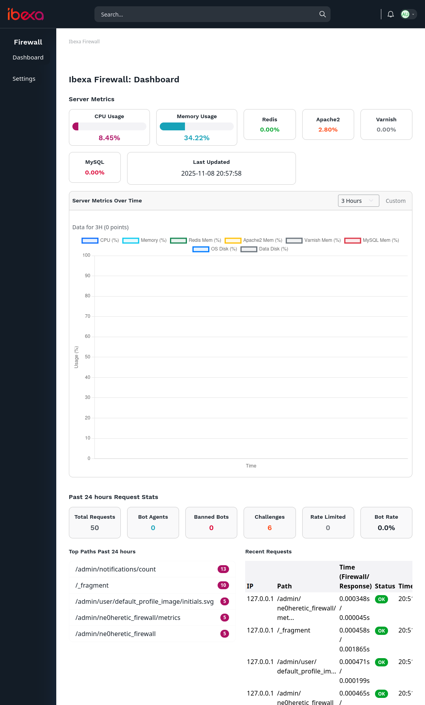
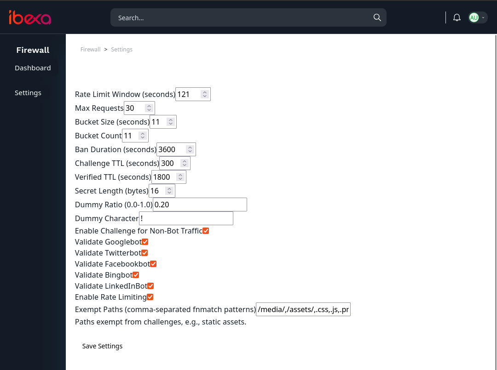
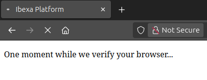

# Ne0Heretic Firewall Bundle for Ibexa

A robust, configurable firewall bundle for [Ibexa CMS](https://ibexa.co/) (formerly eZ Platform) designed to protect against bots, DDoS attacks, and malicious traffic. It combines bot validation (via DNS checks for known crawlers), rate limiting, and a client-side JavaScript Proof-of-Work (PoW) challenge system to ensure only legitimate browsers proceed.

This bundle is lightweight, Redis-powered for caching, and integrates seamlessly with Ibexa's admin UI for monitoring and configuration.

## Features

| Feature                  | Description                                                                 | Configurable? |
|--------------------------|-----------------------------------------------------------------------------|---------------|
| **Bot Validation**      | Validates popular bots (Googlebot, Twitterbot, Facebookbot, Bingbot, LinkedInBot) using forward/reverse DNS checks. Fake bots are banned globally. | Yes (enable/disable per bot) |
| **Rate Limiting**       | Sliding-window rate limiting with bucketed counters to prevent abuse. Exceeds limit? IP is temporarily banned. | Yes (window, max requests, buckets) |
| **JS Challenge (PoW)**  | Obfuscated JavaScript challenge (broken Base64 reversal + dummy chars) with anti-debugging (WebDriver, canvas fingerprinting). Solves via localStorage/cookies. | Yes (TTL, secret length, dummy ratio) |
| **Admin Dashboard**     | Real-time metrics, request logs, server stats (CPU, memory, disk). Powered by Doctrine and Redis. | N/A |
| **Exemptions**          | Skip challenges for static assets (e.g., `/media/*`, CSS/JS files) using fnmatch patterns. | Yes |
| **Persistence**         | Logs requests and metrics to DB; cron job for cleanup. Redis for fast checks. | N/A |
| **Security Policies**   | Ibexa policy integration for admin access control. | N/A |

## Requirements

- Ibexa CMS ^4.0 (or compatible Symfony 6/7)
- PHP ^8.1
- Redis (for caching and rate limiting)
- Doctrine DBAL (for logging)
- Node.js (optional, for JS obfuscation via `javascript-obfuscator`)
- Composer

## Installation

1. **Install the Bundle via Composer**:
   ```bash
   composer require ne0heretic/firewall-bundle
   ```

2. **Enable the Bundle** (if not auto-registered):
    Update composer.json "autoload" to:
    ```javascript
        "autoload": {
            "psr-4": {
                "App\\": "src/",
                "": "bundles/"
            }
        },
    ```

    Create ./bundles

    Copy the bundle folder to ./bundles/Ne0Heretic/.

    Copy ne0heretic_firewall.yaml.sample to ./config/routes/ne0heretic_firewall.yaml

    Then update ./config/bundles.php

   Add to `config/bundles.php`:
   ```php
   return [
       // ...
       Ne0Heretic\FirewallBundle\Ne0HereticFirewallBundle::class => ['all' => true],
   ];
   ```

3. **Install Dependencies**:
   - Ensure Redis is running and configured in `config/packages/cache.yaml` (use `cache.app` pool).
   - Install JS obfuscator globally (optional but recommended):
     ```bash
    yarn add javascript-obfuscator
     ```
   - Install other yarn dependencies:
     ```bash
    yarn add chart.js
     ```

4. **Database Setup**:
   Execute the following SQL to create required tables:
   ```sql
   CREATE TABLE http_request_logs (
       id INT AUTO_INCREMENT PRIMARY KEY,
       ip VARCHAR(45) NOT NULL,
       path VARCHAR(255) NOT NULL,
       query TEXT,
       agent TEXT,
       firewallTime DECIMAL(10,6),
       responseTime DECIMAL(10,6),
       isBotAgent TINYINT(1) DEFAULT 0,
       isBannedBot TINYINT(1) DEFAULT 0,
       isChallenge TINYINT(1) DEFAULT 0,
       isRateLimited TINYINT(1) DEFAULT 0,
       timestamp DATETIME DEFAULT CURRENT_TIMESTAMP
   );

   CREATE TABLE server_metrics (
       id INT AUTO_INCREMENT PRIMARY KEY,
       cpu DECIMAL(5,2),
       memory DECIMAL(5,2),
       redis_mem DECIMAL(5,2),
       apache2_mem DECIMAL(5,2),
       varnish_mem DECIMAL(5,2),
       mysql_mem DECIMAL(5,2),
       os_disk DECIMAL(5,2),
       data_disk DECIMAL(5,2),
       timestamp DATETIME DEFAULT CURRENT_TIMESTAMP
   );

   CREATE TABLE firewall_config (
       id INT PRIMARY KEY DEFAULT 1,
       config JSON NOT NULL
   );
   ```
   Insert default config row:
   ```sql
   INSERT INTO firewall_config (id, config) VALUES (1, '{}');
   ```

5. **Configure Policies**:
   The bundle auto-registers policies via `PolicyProvider`. Grant admin access:
   - In Ibexa admin: Content > Roles > [Your Role] > Policies > Add Policy > Module: `ne0heretic_firewall`, Function: `admin`.

6. **Set Up Cron Job for Data Persistence**:
   Add to crontab (runs every minute):
   ```bash
   * * * * * php bin/console ibexa:firewall:store
   ```

7. **Clear Cache and Restart**:
   ```bash
   php bin/console cache:clear
   # Restart web server if needed (e.g., Apache/Nginx)
   ```

8. **Access the Dashboard**:
   Log in to Ibexa admin > Navigate to "Content" menu > "Firewall" (left sidebar).

## Configuration

Publish and customize config in `config/packages/ne0heretic_firewall.yaml`:
```yaml
ne0heretic_firewall:
    rate_limiting:
        window: 121  # Seconds
        max_requests: 30
        bucket_size: 11
        bucket_count: 11
        ban_duration: 3600  # Seconds
    challenge:
        ttl: 300  # Challenge expiration
        verified_ttl: 1800  # Verified IP TTL
        secret_length: 16  # Bytes
        dummy_ratio: 0.2  # Dummy insertion rate
        dummy_char: '!'  # Invalid Base64 char
        enabled_for_non_bots: true
    bots:
        google_enabled: true
        twitter_enabled: true
        facebook_enabled: true
        bing_enabled: true
        linkedin_enabled: true
    exemptions:
        paths:
            - '/media/*'
            - '/assets/*'
            - '*.css'
            - '*.js'
            - '*.png'
            - '*.jpg'
    enable_rate_limiting: true
```

For environment-specific overrides: `config/packages/prod/ne0heretic_firewall.yaml`.

**Settings UI**: Use the admin "Firewall > Settings" page to tweak runtime options (persisted to DB).

## Usage

- **Monitoring**: Dashboard shows live stats, recent requests, and charts (via AJAX metrics endpoint).
- **Customization**: Extend `KernelListener` for custom bot patterns or challenge logic.
- **Cron Maintenance**: The `ibexa:firewall:store` command flushes Redis logs to DB and prunes old data (7 days for requests, 90 days for metrics).

## Screenshots


*Firewall Dashboard: Metrics and Recent Requests*


*Admin Settings: Configure Rate Limits and Challenges*


*Client-Side JS Challenge Screen*

## Contributing

1. Fork the repo.
2. Create a feature branch (`git checkout -b feature/AmazingFeature`).
3. Commit changes (`git commit -m 'Add some AmazingFeature'`).
4. Push to branch (`git push origin feature/AmazingFeature`).
5. Open a Pull Request.

## License

MIT License. See [LICENSE](LICENSE) for details.

## Support

- Issues: [GitHub Issues](https://github.com/ne0heretic/ibexa-firewall-bundle/issues)
- Docs: Inline code comments.
- Twitter: [@ne0heretic](https://twitter.com/ne0heretic) for updates.

Built with ❤️ for the Ibexa community. Contributions welcome!